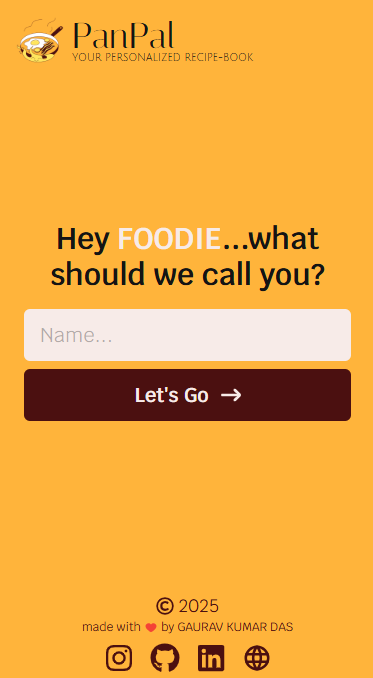
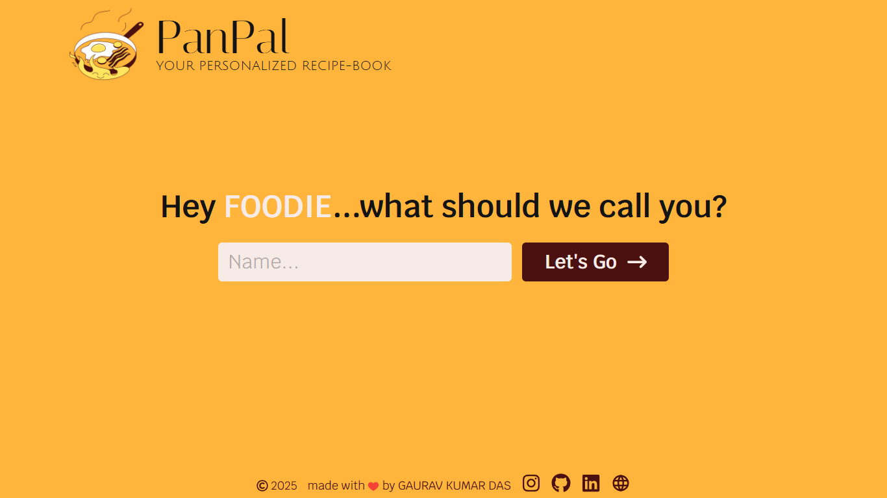
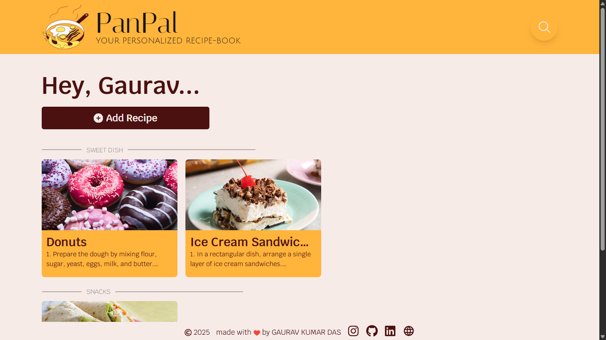
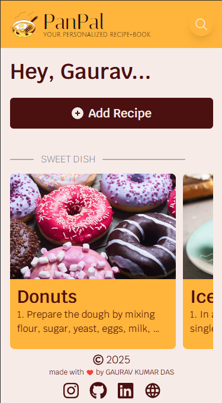
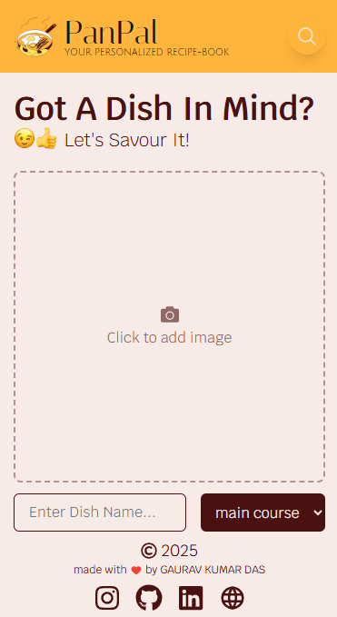
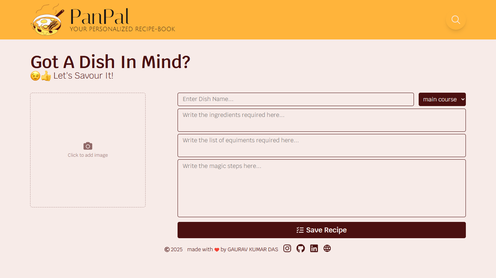
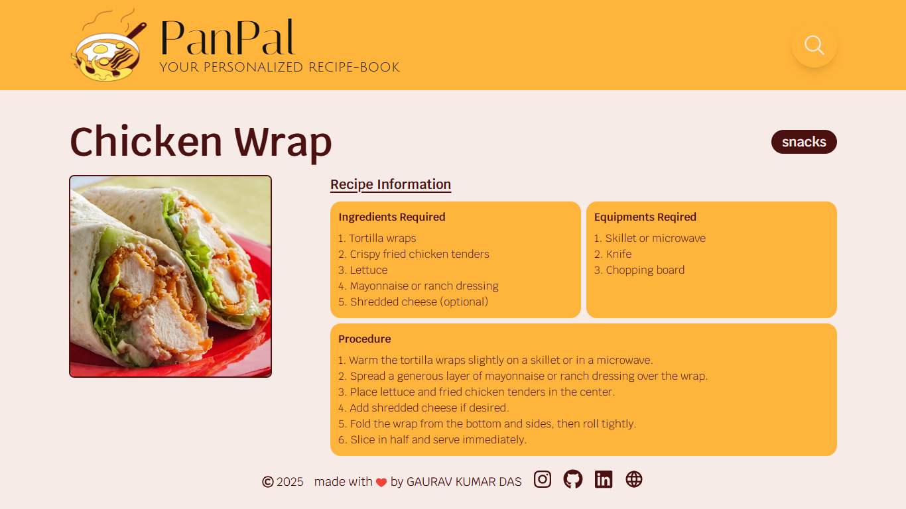
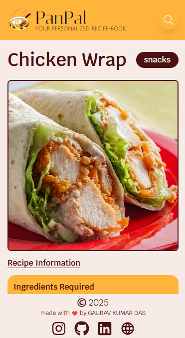

# PanPal 
A web-based personalized recipe book

🔗[flipperrr - Live Link](https://panpal.vercel.app/)\
🖌️[view Figma design here](https://www.figma.com/design/EG4ULbhkzexIaxxjZ3Fd3y/Recipe-Book---UM-Internship?node-id=0-1&p=f&t=5LQSYaqfeOrtnDdE-0)

## 📸 Project Screenshots
<p>


</p>
<p>


</p>
<p>


</p>
<p>


</p>

## 💻 Tech Stack
- React.js
- TailwindCSS

## 🪄 Installation
1. Clone the project from [Github](https://github.com/gaurav1-9/panpal)
```bash
git clone https://github.com/gaurav1-9/panpal.git
cd flipperrr
```
2. Install the dependencies using ```npm i```
3. Start the Development Server using the command ```npm run dev```

## 🤝 Contributing

Feel free to explore the live site and connect with me for feedback or collaboration! 😉✌️